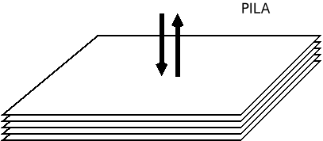
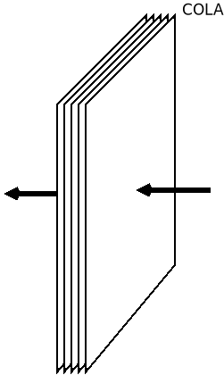

.. _arrays:

Arrays
======
El tipo más básico para almacenar una secuencia ordenada de valores es el
**array**, que es un tipo particular de objeto:

.. code-block:: javascript

   let sec = []; // Una secuencia vacía.
   sec instanceof Array;  // true
   sec instanceof Object; // true
   typeof sec; // 'object'

Para crear uno podemos usar la notación del corchete o bien usar el constructor
Array_:

.. code-block:: javascript

   let sec1 = [1, 2, 3],
       sec2 = new Array("a", "b", "c");

En ambos casos, se obtiene lo mismo.  Es posible también, crear un array sin
valores de una longitud determinada:

.. code-block:: javascript

   const arr1 = Array(10),        // arr1 tiene diez posiciones, pero sin valor las diez.
         arr2 = Array(5).fill(0); // arr2 tiene 5, pero con valor 0.

Los *arrays*, como otros iterables, soportan a partir de *ES2015* el operador de
dispersión (*spread operator*) que permite desempaquetar los elementos:

.. code-block:: javascript

   const arr1 = [1, 2],
         arr2 = [3, 4];

   console.log([...arr1, ...arr2, 5, 6]); // [1, 2, 3, 4, 5, 6]

   function suma(a, b) { return a + b };
   suma(1, 2);       // Devuelve 3
   suma(...arr1);    // Equivalente a lo anterior.

Como en otros lenguajes de programación, la secuencia no tiene por qué ser de
datos del mismo tipo:

.. code-block:: javascript

   let sec = ["a", 1, true, null, {x: 1}, function() { console.log("Hola"); }];

y es de naturaleza dinámica, por lo que podremos alterar los valores de sus
elementos, añadir otros o eliminar algunos.

Acceso y manipulación
---------------------
Para acceder a sus elementos puede usarse la notación del corchete:

.. code-block:: javascript

   sec[1];        // 1
   sec[3];        // null
   sec[4].x;      // 1
   sec[5] = "b";  // Sustituimos la función anónima por "b".

También existe el método `.at
<https://developer.mozilla.org/es/docs/Web/JavaScript/Reference/Global_Objects/Array/at>`_
que permite indicar un índice como argumento para devolver:

.. code-block:: javascript

   sec.at(1);    // 1
   sec.at(3);    // null

La ventaja de este método es que permite indicar índices negativos y, entonces,
se cuenta desde atrás como en el caso de *Python*:

.. code-block:: javascript

   sec.at(-1);   // "b", último elemento.
   sec.at(-3);   // null, antepenúltimo elemento.

Tanto de una forma o de la otra, cuando se intenta obtener el valor de un
elemento que no existe, se devuelve ``undefined`` en vez de generarse un error:

.. code-block:: javascript

   sec[20];     // undefined
   sec.at(100); // undefined

Si nos interesa obtener la posición de un elemento por su valor, podemos echar
mano de `.indexOf()`_:

.. code-block:: javascript

   sec.indexOf(true);                     // 2
   sec.indexOf("Este valor no existe");   // -1, porque no se encuentra.

Puede añadirse un seguno argumento con el índice desde el que se desea comenzar
la búsqueda:

.. code-block:: javascript

   sec.indexOf(true, 3);   // -1, porque no hay otro true.

En caso de que, simplemente, nos interese saber si el valor existe o no, sin
importar su posición, puede usarse `.includes()`_:

.. code-block:: javascript

   sec.includes(true)     // true
   sec.includes(true, 3)  // false, ya que no vuelve a encontrarse. 

Podemos eliminar el valor de un elemento (que no el elemento mismo) con el
operador delete_:

.. code-block:: javascript

   delete sec[1];  // La posición 1 queda vacía, pero sigue existiendo como undefined
   sec[2];         // true
   sec[1];         // undefined

Puede conocerse su longitud a través de la propiedad `.length
<https://developer.mozilla.org/es/docs/Web/JavaScript/Reference/Global_Objects/Array/at>`_:

.. code-block:: javascript

   sec.length;  // 6.

La dinamicidad del tipo es tal que podemos alterar la longitud de la secuencia modificando el valor de esta propiedad:

.. code-block:: javascript

   sec.length = 8;  // Ahora las posiciones 6 y 7, existen pero están vacías (undefined).
   sec.length;      // 8, no 6.

Si le asignamos un valor más pequeño, entonces eliminaremos los elementos
sobrantes:

.. code-block:: javascript

   sec.length = 5;
   sec.at(-1);      // {x: 1}, ya que se ha perdido "b" y las otras dos posiciones indefinidas

También alteraremos el tamaño del array, si asignamos valor a una posición sin
elemento:

.. code-block:: javascript

   sec[9] = "Final";
   sec.at(-1)          // 'Final'
   sec.length;         // 10. Entre la posición 5 y 8 hay valores indefinidos.

Además, dispone del método `.slice()
<https://developer.mozilla.org/es/docs/Web/JavaScript/Reference/Global_Objects/Array/slice>`_
que permite extraer una parte de la secuencia indicando la posición inicial y la
final (esta última sin incluir):

.. code-block:: javascript

   sec.slice(1, 3);   // [undefined, true], la 3 no.
   sec.slice(2, -1);  // [true, null], la última no.

Si se deja sin especificar la primera posición se sobreentiende que es desde el
principio y si se deja sin especificar la segundo hasta el final:

.. code-block:: javascript

   sec.slice(2);            // [true, null, {x: 1}]
   sec.slice(undefined, 3); // ["a", undefined, true]
   sec.slice();             // Copia completa.

Por último, es posible manipular una parte de su contenido usando el método `.splice()
<https://developer.mozilla.org/es/docs/Web/JavaScript/Reference/Global_Objects/Array/splice>`_,
que exige indicar la posición inicial, el número de posiciones y el valor de
sustitución. Para indicar más valores de sustitución, pueden añadirse más
argumentos:

.. code-block:: javascript

   sec.splice(1, 1, false);                 // Sustituye exclusivamente la posición 1.
   sec.splice(-1, 0, "Nuevo elemento");     // Antes el último elemento, añade la cadena.
   sec.splice(0, 2);                        // Elimina los dos primeros elementos.
   sec.splice(1, 1, "A", "B");              // Sustituye la posición 1 por ["A", "B"]
   sec.splice(1, 1, ...["A", "B"]);         // Lo mismo.
   sec.splice.apply(sec, 1, 1, ["A", "B"]); // Lo mismo, pero sin usar la notación ...

El método, además, devuelve un array con los elementos sustituidos:

.. code-block:: javascript

   sec = [1, 2, 3, 4, 5];
   let desocupados = sec.splice(1, 2, "Ocupante");
   sec;          // [1,"Ocupante", 4, 5]
   desocupados;  // [2, 3]

Pila
----
En una :dfn:`pila` los elementos se añaden o se consumen por el final:

Para poder usar un array como una pila, existen los métodos `.push()
<https://developer.mozilla.org/es/docs/Web/JavaScript/Reference/Global_Objects/Array/push>`_,
que añade elementos al final de la pila y `.pop()
<https://developer.mozilla.org/es/docs/Web/JavaScript/Reference/Global_Objects/Array/pop>`_,
que los consume:

.. code-block:: javascript

   sec = [];         // Pila vacía.
   sec.push(1, 2);   // Añadimos al final dos elementos: [1, 2]
   sec.push(3);      // Añadimos otros: [1, 2, 3]
   sec.pop();        // Devuelve el último elemento (3) y lo elimina: [1, 2]

Cola
----
En una :dfn:`cola`, por su parte, se consumen elementos por la cabeza y se
añaden por el final:

Para tratar un array como una cola necesitamos método ya visto `.push()`_ y el
método `.shift() <https://developer.mozilla.org/es/docs/Web/JavaScript/Reference/Global_Objects/Array/shift>`_ para eliminar el primer elemento:

.. code-block:: javascript

   sec = [];         // Cola vacía.
   sec.push(1, 2);   // Añadimos al final dos elementos: [1, 2]
   sec.push(3);      // Añadimos otros: [1, 2, 3]
   sec.shift();      // Devuelve el primer elemento (1) y lo elimina: [2, 3]

.. note:: Existe también el método `.unshift() <https://developer.mozilla.org/es/docs/Web/JavaScript/Reference/Global_Objects/Array/shift>`_, que
   añade elementos por la cabeza y es análogo a ``.push()``.

Recorrido
---------
Para recorrer todos los elementos tenemos varias alternativas:

La clásica de C:

.. code-block:: javascript

   for(let i=0; i<sec.length; i++) {
      // Hacemos algo con el elemento sec[i].
   }

La versión que recorre directamente elementos, más parecida a lenguajes como
*Python*:

.. code-block:: javascript

   for(const e of sec) { // of, no in.
      // Hacemos algo con el elemento e.
   }

Una variante funcional a través del método `.forEach()`_:

.. code-block:: javascript

   sec.forEach((e, i, arr) => {  // También puede usarse una función tradicional
      // Hacemos algo con e (elemento), i (indice) o arr (el array completo).
   });

.. note:: Muchos métodos y funciones cuyo argumento es una
   `función de callback
   <https://es.wikipedia.org/wiki/Retrollamada_(inform%C3%A1tica)>`_, permite
   incluir un segundo argumento que defina el objeto de contexto (``this``) de
   la función de *callback*. ``.forEach()`` no es una excepción:

   .. code-block:: javascript

      sec.forEach(function(e) {
         // Hacemos algo con e.
         // El this de esta función es la cadena "Soy el contexto".
      }, "Soy el contexto");

   Por supuesto para poder redefinir el contexto es necesario usar funciones
   tradicional, no :ref:`funciones flecha <func-flecha>`.

Otros métodos
-------------
Array_ dispone de bastante métodos, algunos de los cuales son muy útiles:

`Array.from()`_
   Devuelve un array con todos los valores que contenga un dato iterable. Por
   ejemplo, una cadena es un dato iterable, así que:

   .. code-block:: javascript

      Array.from("abc");  // [ 'a', 'b', 'c' ]

`.join()`_
   Yuxtapone todos los elementos del array, utilizando el separador indicado:

   .. code-block:: javascript

      sec = ["Uno" ,"que", "sabe", "reñir"];
      sec.join(" ");    // Uno que sabe reñir

`.flat()`_
   Deshace los subarrays que contiene un array hasta la profundidad que defina
   el argumento (un nivel, si no se especifica nada):

   .. code-block:: javascript

      let profundo = [1, [2 , [3, [4, 5]]]];
      profundo.flat();          // Devuelve [1, 2, [3, [4, 5]]]
      profundo.flat(2)          // Devuelve [1, 2, 3, [4, 5]]
      profundo.flat(Infinity);  // Devuelve [1, 2, 3, 4, 5]

`.fill()`_
   Rellena todo el array con el valor que se da como argumento:

   .. code-block:: javascript

      const arr = Array(10);

      arr.fill("XXX");

   .. note:: Observe que ``arr`` es una constante, pero el array que representa
      puede cambiar de valor. Esto es así, porque ``arr`` es una referencia a
      un objeto (un *array* en este caso particular) y que éste cambie su valor,
      no implica que la referencia cambie: la referencia sigue siendo al mismo
      objeto. En cambio, sí provocaría error:

      .. code-block:: javascript

         arr = ["soy", "otro", "array"]  // Error.

      En cambio:

      .. code-block:: javascript

         const numero = 2;

      provoca que la variable sea dos y siempre valga dos, porque hacer que
      número valga 3 implica hacer una nueva asignación y, por tanto, una nueva
      referencia:

      .. code-block:: javascript

         numero = 3;

      No hay forma de original de que el dato 2 se transforme en un 3. Esto es
      lo que distingue a los datos primitivos de los que no lo son.

`.find()`_, `.findIndex()`_
   Permite encontrar el primer valor (o su índice asociado, si es
   ``.findIndex()``) que cumpla con una determinada condición. La condición 
   se define mediante la función que se le proporciona com primer argumento:
   cuando tal función devuelve ``true`` la condición se considera satisfecha.
   Por ejemplo:

   .. code-block:: javascript

      sec = [1, 2, 4, 6, 5, 7, 9, 10];
      sec.find(e => e % 3 === 0);         // Devuelve 6 (el primer múltiplo de 3)

   La función de *callback*, como en el caso de ``.forEach()``, también tiene
   acceso al índice (segundo argumento) y al propio array (tercer argumento).

   .. note:: Estos métodos son una generalización de ``.indexOf()``, pero no
      admiten como segundo argumento un índice a partir del cual buscar, sino,
      como en el caso de otros métodos que admiten funciones de *callback*, un
      objeto de contexto alternativo para la función.

`.every()`_, `.some()`_
   Comprueba si todos (``.every()``) o al menos uno (``.some()``) de los
   elementos del array cumplen con la condición expresada en la función de
   *callback*:

   .. code-block:: javascript

      sec.some(e => e < 0);  //false, porque ningún elemento es negativo.
      sec.every(e => e > 0); //true, todos los elementos son positivos.

`.filter()`_
   Obtiene un array que contiene los elementos que pasan el filtro de la función
   de *callback*:

   .. code-block:: javascript

      sec.filter(e => e % 3 === 0); // [6, 9], o sea, los elementos múltiplos de 3.

`.map()`_
   Obtiene un nuevo array cuyos elementos son el resultado de aplicar a los
   elementos del original la función de *callback*:

   .. code-block:: javascript

      sec.map(e => e % 2);  // [1, 0, 0, 0, 1, 1, 1, 0]

`.reduce()`_
   Obtiene un único valor como consecuencia de aplicar la función de *callback*
   sobre todos los elementos:

   .. code-block:: javascript

      sec.reduce(function(res, e, i, arr) {
         return res + e;
      }, 0);

   El primer argumento es la variable que recoge el valor de la iteración
   anterior. En este caso, lo único que se hace es devolver la suma de todos los
   elementos del array. El segundo argumento es el valor inicial que tomará
   ``res`` la primera vez. Si no se proporciona, en la primera iteración ``res``
   tomará el valor del primer elemento y la función se ejecutará a partir del
   segundo.

.. note:: Estos últimos cinco métodos son muy habituales en los lenguajes de
   programación funcional.

.. _Array: https://developer.mozilla.org/en-US/docs/Web/JavaScript/Reference/Global_Objects/Array
.. _delete: https://developer.mozilla.org/en-US/docs/Web/JavaScript/Reference/Operators/delete
.. _.indexOf(): https://developer.mozilla.org/es/docs/Web/JavaScript/Reference/Global_Objects/Array/indexOf
.. _.includes(): https://developer.mozilla.org/es/docs/Web/JavaScript/Reference/Global_Objects/Array/includes
.. _.forEach(): https://developer.mozilla.org/es/docs/Web/JavaScript/Reference/Global_Objects/Array/forEach
.. _.find(): https://developer.mozilla.org/es/docs/Web/JavaScript/Reference/Global_Objects/Array/find
.. _.findIndex(): https://developer.mozilla.org/es/docs/Web/JavaScript/Reference/Global_Objects/Array/findIndex
.. _Array.from(): https://developer.mozilla.org/es/docs/Web/JavaScript/Reference/Global_Objects/Array/from
.. _.join(): https://developer.mozilla.org/es/docs/Web/JavaScript/Reference/Global_Objects/Array/join
.. _.flat(): https://developer.mozilla.org/es/docs/Web/JavaScript/Reference/Global_Objects/Array/flat
.. _.fill(): https://developer.mozilla.org/es/docs/Web/JavaScript/Reference/Global_Objects/Array/fill
.. _.every(): https://developer.mozilla.org/es/docs/Web/JavaScript/Reference/Global_Objects/Array/every
.. _.some(): https://developer.mozilla.org/es/docs/Web/JavaScript/Reference/Global_Objects/Array/some
.. _.filter(): https://developer.mozilla.org/es/docs/Web/JavaScript/Reference/Global_Objects/Array/filter
.. _.map(): https://developer.mozilla.org/es/docs/Web/JavaScript/Reference/Global_Objects/Array/map
.. _.reduce(): https://developer.mozilla.org/es/docs/Web/JavaScript/Reference/Global_Objects/Array/reduce
