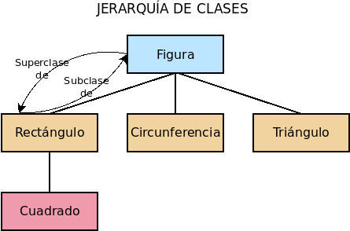
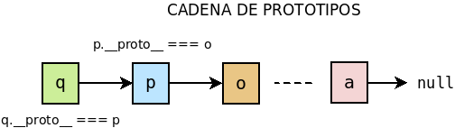
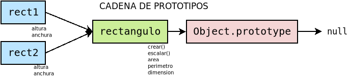
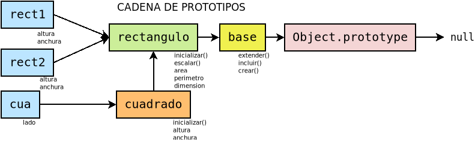
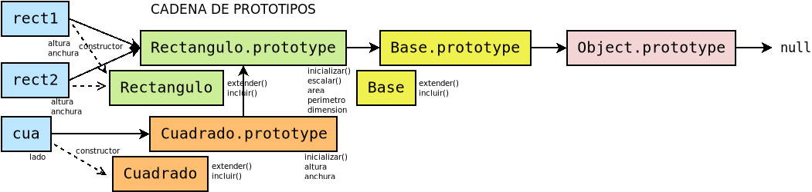

.. highlight:: javascript

.. _objetos:

*******
Objetos
*******
En *Javascript* **NO** existen clases\ [#]_, sólo objetos y éstos no son más que
colecciones de atributos, los cuales pueden ser también funciones, esto es,
métodos::

   const rectangulo = {
      altura: 10,
      anchura: 7,
      area: function() {  // Como este atributo es una función, actúa como método.
         return this.altura*this.anchura;
      }
   }

   console.log(rectangulo.area());  // 70.
   rectangulo.anchura = 8;
   console.log(rectangulo.area());  // 80.

.. note:: Al ser las funciones ciudadanas de primera clase en *Javascript*, los
   métodos son atributos cuyo valor es una función. Por este motivo, podemos
   incluir los métodos dentro del término atributos y así se hará a lo largo del
   texto. La fórmula expuesta en el código para definir ``rectangulo`` deja
   clara esta equivalencia, puesto que *area* se define de modo análogo a
   *anchura* y *altura*. Sin embargo, hay una sintaxis simplificada para definir
   métodos que enmascara esta equivalencia::

      const rectangulo = {
         altura: 10,
         anchura: 7,
         area() {  // Como este atributo es una función, actúa como método.
            return this.altura*this.anchura;
         }
      }

   La utilizaremos ya que hemos dejado clara la naturaleza de los métodos como
   *atributos función*.

Así, pues, hemos construido un objeto ex novo a diferencia de todos esos
lenguajes orientados a objetos en que la creación de una clase implica la
instanciación de una clase. Comenzaremos por describir cómo son estos objetos
sin entrar a discutir estrategias para tener objetos semejantes (o sea, de una
misma *clase*) o parecidos\ [#]_

Características
***************

Definición
==========
En el ejemplo anterior, ya se expuesto la sintaxis básica para definir un
objeto: un diccionario de pares clave/valor donde la clave es una cadena o un
`símbolo
<https://developer.mozilla.org/en-US/docs/Web/JavaScript/Reference/Global_Objects/Symbol>`_
y se separa del valor mediante dos puntos. Si los valores se encuentran en
variables aparte cuyo nombre coincide con el que tendrá la clave::

   const anchura = 10, altura = 7;
   const rectangulo = {
      altura: altura,
      anchura: anchura,
      area() { return this.altura*this.anchura; }
   }

entonces puede usarse una sintaxis simplificada::

   const anchura = 10, altura = 7;
   const rectangulo = {
      altura,
      anchura,
      area() { return this.altura*this.anchura; }
   }

incluso para el método área, aunque como en este caso no hemos podido hacer uso
de la simplificación al no haber definido aparte la función *area*,

Por supuesto, tenemos total libertad para extender el objeto añadiendo nuevos
atributos::

   rectangulo.escalar = function(factor) {
      this.altura *= factor;
      this.anchura *= factor;
   }

o para eliminar atributos ya definidos::

   delete rectangulo.escalar;

Obsérvese que al hacer las definiciones, la clave no se ha escrito entre
comillas, sino sin ellas, pese a lo cual se sobreentiende como un literal. Si la
clave que se desea usar, se encuentra dentro de una variable, entonces se
requiere una sintaxis especial que haga entender al procesador que la clave no
es literal::

   const d1 = "altura", d2 = "anchura";

   const rectangulo = {
      [d1]: 10,
      [d2]:  7,
      area() { return this[d1]*this[d2]; }
   }

Uso
===
Para utilizar los atributos basta con usar la sintaxis del punto::

   console.log(rectangulo.altura);  // 10.
   console.log(rectangulo.area());  // 70.
   rectangulo.area = 8;
   console.log(rectangulo.area());  // 80.

aunque también podemos usar una sintaxis basada en corchetas::

   rectangulo["anchura"] = 5;
   rectangulo["area"]();  // 80.

Esta segunda sintaxis es interesante cuando el nombre de la propiedad la tenemos
dentro de una variable::

   let dimension = "anchura";
   rectangulo[dimension] = 6;

.. _object-descriptors:

Descriptores
============
Hasta ahora, al añadir atributos a un objeto nos hemos dedicado a enchufarlos
sin más. Sin embargo, cada atributo posee un descriptor que define las
características del atributo dentro del objeto.

.. _object.getownpropertydescriptor:

`Object.getOwnPropertyDescriptor()`_
   Muestra el desriptor del atributo de un objeto::

      Object.getOwnPropertyDescriptor(rectangulo, "altura")
      { value: 10, writable: true, enumerable: true, configurable: true }

Además del valor, obtenemos que el atributo es:

* :dfn:`writable`, razón por la cual podemos darle un valor distinto.
* :dfn:`configurable`, razón por la cual podríamos cambiar estas propias
  características, haciendo que, por ejemplo, el valor fuera inmutable.
* :dfn:`enumerable`, lo que significa que el atributo será más visible, esto es,
  que algunas funciones que veremos más adelante serán capaces de ver que este
  atributo existe\ [#]_. 

Hay dos **tipos** de descriptores:

- :dfn:`Descriptor de dato`, que describe un atributo normal como el anterior y
  que se caracteriza por tener un valor (**value**).
- :dfn:`Descriptor de acceso`, que describe lo que en *Python* se denomina
  *propiedad*, esto es, un dato que dispone de un *setter* para establecer su
  valor y un *getter* para devolverlo. Por ejemplo, podríamos convertir las dos
  dimensiones de nuestro rectángulo en sendas propiedades para controlar que
  siempre introduzcan un número como valor. En este caso, el descriptor, en vez
  de disponer *value*, dispondrá *set* y *get*, Tampoco tendrá la
  característicva *writable*, que no tiene sentido, puesto que si se desea que
  la propiedad sea de sólo lectura, basta con no definir el *setter*. Las otras
  dos características, sin embargo, siguen teniendo validez. Dejaremos la
  discusión de las :ref:`propiedades <object-properties>` para el siguiente epígrafe.

Al definir un atributo (bien al crear un objeto, bien añadiéndolo después), las
características ``writable``, ``enumerable`` o ``configurable`` estarán siempre
a *true*. Para que adopten otro valor pueden usarse:

.. _object.defineproperty:

`Object.defineProperty()`_
   Permite definir o redefinir el descriptor de un atributo. Por ejemplo::

      Object.defineProperty(rectangulo, "color", {
         value: "negro",
         configurable: true
      })

   De esta forma añadimos un nuevo atributo puesto que el atributo color no
   existía previamente, y, además, indicamos cuál será el descriptor del dato.
   En el código no hemos incluido dos características (*writable* y
   *enumerable*), por lo que estas se fijarán a *false*. Cuando lo que se hace
   es utilizar un atributo ya existente, las características no enunciadas
   mantendrán su valor.

   Con esta definición, no podremos cambiar el color del rectángulo (*writable*
   es *false*)::

      rectangulo.color = "azul";
      rectangulo.color;  // Sigue siendo negro.

   pero podremos alterar el descriptor puesto que *configurable* lo fijamos a
   verdadero. También podremos borrar el atributo ya que es *configurable* quien
   controla esta posibilidad.

.. _object.defineproperties:

`Object.defineProperties()`_
   Como el anterior pero permite definir o redefinir a la vez los descriptores
   de varios atributos::

      Object.defineProperties(rectangulo, {
         color: {
            writable: false
         },
         altura: {
            configurable: false
         },
         anchura: {
            configurable: false
         },
         area: {
            enumerable: false
         }
      )

   Gracias a esto, no podremos borrar la altura ni la anchura del rectángulo.

.. note:: Ambos métodos devuelven el propio objeto sobre el que se definen los
   descriptores (en este caso *rectangulo*).

Lista de atributos
==================
Hay algunos modos de conocer cuáles son los atributos que tenemos disponibles en
un objeto:

`Object.getOwnPropertyNames()`_
   Devuelve un *array* con los nombres de todos los atributos propios del
   objetos, sean estos enumerables o no::

      Object.getOwnPropertyNames(rectangulo);  // [ 'altura', 'anchura', 'area', 'color' ]

.. _object.keys:

`Object.keys()`_
   Devuelve un *array* con los nombres de los atributos enumerables disponibles
   en el objeto::

      Object.getOwnPropertyNames(rectangulo);  // [ 'altura', 'anchura', 'color' ]

   donde no aparece ``area`` puesto que la definitmos antes como no enumerable.
   Sin embargo, la diferencia con respecto a la función anterior, va más allá de
   listar o no los atributos enumerables. `Object.keys()`_ lista también atributos
   que, aunque no han sido definidos en el propio objetos, los ha heredado. Aún
   no hemos tratado las características de la |POO| aplicadas a *Ĵavascript*,
   pero ya veremos cómo unos objetos pueden heredar de otros.

`.hasOwnProperty(name)`_
   Es un método del objeto que comprueba si el objeto tiene un atributo propio
   con el nombre suministrado, sea enumerable o no::

      rectangulo.hasOwnProperty("area");  // true.

   .. note:: Obsérvese que este método `.hasOwnProperty(name)`_  no lo hemos
      definido nosotros en el objeto, así que forzosamente debe ser un método
      heredado. Porque no es propio, no nos lo devolvió
      `Object.getOwnPropertyNames()`_ y, porque no es enumerable, no lo hizo
      `Object.keys()`_

.. _object-properties:

Propiedades
===========
Las propiedades son atributos que, en vez de definir un valor, definen un
*setter* y un *getter*, aunque alguna de estas dos funciones puede no existir.
Podemos definir un atributo de este tipo declarando el descriptor
explícitamente (con `Object.defineProperty()`_ o `Object.defineProperties()`_)::

   Object.defineProperty(rectangulo, "perimetro", {
      get: function() {
         return 2*(this.anchura + this.altura);
      },
      enumerable: true
   });

   rectangulo.perimetro; // 34, o sea, 2*(10 + 7)

En este caso, hemos añadido una propiedad de sólo lectura, esto es, con
*getter*, pero no con *setter*. Alternativamente, la definición puede hacerse
así::

   Object.defineProperty(rectangulo, "perimetro", {
      get() {
         return 2*(this.anchura + this.altura);
      },
      enumerable: true
   });

Las propiedades también pueden definirse en el momento de crear el objeto. Por
ejemplo, si quisiéramos crear el objeto ``rectángulo`` de manera que anchura y
altura fueran propiedades, podríamos hacer lo siguiente::

   const rectangulo = {
      get altura() {
         return this._altura;
      },
      set altura(value) {
         if(typeof value !== 'number') throw new TypeError('Valor no numérico');
         this._altura = value;
      },
      get anchura() {
         return this._altura;
      },
      set anchura(value) {
         if(typeof value !== 'number') throw new TypeError('Valor no numérico');
         this._anchura = value;
      },
      area: function() {  // Como este atributo es una función, actúa como método.
         return this.altura*this.anchura;
      }
   }

   rectangulo.altura = 10;
   rectangulo.anchura = "No soy un número";  // Provoca error.

Nótese que en realidad los atributos *anchura* y *altura* no almacenan ningún
valor, por lo que necesitamos crear sendos atributos adicionales pàra cumplir
esta tarea.  Estos atributos, sin embargo, no han sido añadidos de ningún modo
especial por lo que son perfectamente accesibles y enumerables. En el código
anterior, nos hemos limitado a usar la notación del subrayado para hacer notar
que el atributo no debería usarse. Podemos usar otras técnicas más elaboradas.
Por ejemplo, utilizar como claves símbolo y, además, hacer no enumerable el
atributo::

   const altura = Symbol('altura');
   const anchura = Symbol('anchura');

   const rectangulo = {
      get altura() {
         return this[altura];
      },
      set altura(value) {
         if(typeof value !== 'number') throw new TypeError('Valor no numérico');
         this[altura] = value;
      },
   // etc...
   }

   Object.defineProperties(rectangulo, {
      [altura]: {enumerable: false},
      [anchura]: {enumerable: false}
   });

Observación
============
.. todo:: Breve explicación de `Proxy
   <https://www.todojs.com/introduccion-a-proxy-de-es6/>`_.

Manejo de objetos
*****************
El ejemplo expuesto hasta aquí (un objeto único que definimos y usamos) no es un
ejemplo en absoluto real. Lo habitual es que requiramos crear muchos objetos que
comparten una misma naturaleza o bien una naturaleza semejante. Así, pues, el
*quid* de la cuestión está en poder construir objetos de naturaleza idéntica o
semejante de manera que se cumplan los principios de abstracción, encapsulación,
reutilización y extensibilidad.

Esto lo resuelven generalmente los lenguajes orientados a objetos recurriendo a
las clases y convirtiendo a cada objeto en la instanciación de su clase
correspondiente. La herencia, además, es el mecanismo que principalmente permite
la reutilización del código. Tal es el caso de lenguajes como *C++*, *Java* o
*Python*.  *Javascript* tiene una filosofía totalmente distinta; pero, como es
enormemente versátil, es capaz de implementar los objetos usando esta estrategia
hereditaria de clases. Sin embargo, hay voces extremadamente críticas con
trasladar las clases a *Javascript* e, incluso, con utilizar la herencia como
estrategia para la reutilización del código.

.. note:: A este respecto son muy interesantes las lecturas de:

   - El artículo `Why prototypal inheritance matters`_ de Aadit M Shah, basado
     en la herencia (y la composición) prototípica.
   - El demoledor artículo `Two pillars of Javascript (part I)`_ de Eric Elliott,
     que critica ferozmente la herencia.
   - El artículo `Goodbye, Object Oriented Programming`_ de Charles Scalfani
     que profundiza en los problemas de |POO| basada en la herencia de clases.
   - El artículo, también de Eric Elliott, `The Hidden Treasures of Object Composition`_
     que discute sobre la composición de objetos

Con *Javascript* podemos practicas enfoques distintos:

- Utilizar la herencia sin recurrir a la clases, sino basándonos en el concepto
  del prototipo, que es realmente en lo que se basa la |POO| de *Javascript*
  (*composición de objetos por delegación*).
- Recrear el modelo de *clases* jerárquicas y herencia.
- Ensayar la *composición de objetos por concatenación* como alternativa a la
  herencia.

.. _object-herencia:

Composición por delegación (herencia)
=====================================
.. warning:: Como ya se formuló, hay bastantes voces críticas con el uso de la
   herencia para la reutilización de código. Revise la :ref:`composición
   <object-compos>` como alternativa. Otras opiniones sostienen que para escoger
   si es mejor reutilizar a través de la herencia o a través de la composición
   debe aplicarse el `principio de sustitución de Liskov
   <https://es.wikipedia.org/wiki/Principio_de_sustituci%C3%B3n_de_Liskov>`_.

En los lenguajes que utilizan clases, cada clase constituye la generalización de
un tipo distinto de objeto, de manera que a la definición de una clase
(:dfn:`superclase`) se añaden nuevas definiciones de atributos y métodos para
constituir una clase derivada (:dfn:`subclase`). A conservar los atributos y
métodos de la superclase (o clase padre) es a lo que se denomina :dfn:`herencia`:

La filosofía de *Javascript* es, sin embargo, totalmente distinta en la medida
en que no existen clases\ [#]_. La herencia de este lenguaje se conoce como
:dfn:`herencia prototípica` y consiste en que un objeto deriva (hereda) de
otro llamado :dfn:`prototipo`. Por tanto, si el objeto "b" deriva del objeto
"a", "a" es el prototipo de "b". El prototipo "a", a su vez, puede tener otro
prototipo del que deriva y así sucesivamente en lo que se conoce como
:dfn:`cadena de prototipos`. Obviamente, la cadena no puede ser infinita, sino
que tiene un final en el que el último prototipo deriva de ``null``:

Para implementar la cadena cada objeto posee una propiedad ``[[Proto]]``, que
oficiosamente se nombró ``__proto__`` y con tal nombre acabó pasando al
estándar, que apunta al prototipo. Cuando se invoca el atributo de un objeto,
primero se comprueba si éste está definido en el propio atributo, si lo está se
devuelve su valor y, si no, se comprueba si se encuentra definido en el
prototipo. Esta operación se repite sucesivamente de prototito a prototipo hasta
que o bien se encuentra el valor del atributo o se llega al final de la cadena
sin encontrarlo. En este segundo caso, *Javascript* devolverá ``undefined``.

.. note:: La asignación no funciona así, si se da valor a un atributo, este se
   define sobre el propio objeto.

.. note:: El prototipo de un objeto creado *ex novo*::

      const obj = {}

   no es *null*, sino aquel en que se encuentran definidos métodos como
   `.hasOwnProperty(name)`_: ``Object.prototype``::

      obj.__proto__ === Object.prototype;  // true

   ``Object.prototype`` si es el último objeto de la cadena y por tanto su
   prototipo es *null*::

      Object.prototype.__proto__ === null;  // true.

   De dónde sale este ``Object.prototype``, se entenderá mejor al tratar las
   :ref:`funciones constructoras <object-class>`.

.. _proto-obj:
.. _object.create:

Prototipado con objetos
-----------------------
En la práctica, la forma de crear un objeto cuyo prototipo sea otro objeto es
utilizar `Object.create()`_\ [#]_ que permite la clonación::

   // Objeto prototipo para los rectángulos
   const rectangulo = {
      // Adicionalmente, podríamos definir
      // getters y setters para altura y anchura.

      dimensiones: 2 // Atributo estático.

      get area() {
         return this.altura * this.anchura;
      },

      get perimetro() {
         return 2*(this.anchura + this.altura);
      },

      escalar(factor) {
         this.anchura *= factor;
         this.altura *= factor;
         return this;
      }
   }

   // Ya podemos definir rectángulos, primero definiendo su prototipo
   const rect1 = Object.create(rectangulo);
   // Y después añadiéndole los valores particulares de sus atributos.
   rect1.altura = 5;
   rect1.anchura = 6;

Esta es, ciertamente, una forma muy sucia de construir nuevos objetos a partir
del prototipo, pero podriamos pulirla añadiendo un método de creación, sabiendo
que  `Object.create`_ admite como segundo argumento un objeto que describa
propiedades adicionales del objeto a la manera que lo hace
`Object.defineProperties`_:

.. code-block:: javascript
   :emphasize-lines: 3-14

   const rectangulo = {
      // Genera rectángulos definiendo su altura y anchura.
      crear(altura, anchura) {
         return Object.create(this, {
            altura: {
               value: anchura,
               enumerable: true
            },
            anchura: {
               value: altura,
               enumerable: true
            }
         });
      },

      dimension: 2,

      get area() {
         return this.anchura * this.altura;
      },

      get perimetro() {
         return 2*(this.anchura + this.altura);
      },

      escalar(factor) {
         this.anchura *= factor;
         this.altura *= factor;
         return this;
      }
   }

   const rect1 = rectangulo.crear(5, 6);
   const rect2 = rectangulo.crear(2, 8);

Para implementar la herencia (por ejemplo, generar cuadrados) deberíamos hacer
que el prototipo de la clase derivada fuera *rectangulo*::

   const cuadrado = Object.create(rectangulo, {
      crear: {
         value: function(lado) {
            this.lado = lado;
         }
      },

      anchura: {
         get() {
            return this.lado;
         }
      },

      altura: {
         get() {
            return this.lado;
         }

      }
   });

   const cua = cuadrado.crear(10);

El método de derivación es bastante artesanal y, además, nos obliga a definir
todos los métodos mediante descriptores. Una alternativa más explícita es
definir un método para extender el prototipo del que queremos que deriven otros
prototipos\ [#]_::

   // ...  definición de rectángulo ...

   /* Extiende cualquier prototipo */
   rectangulo.extender = function(props) {
      return Object.create(this, props);
   }

Pero esta definición del método seguiría obligándonos a hacer todas las
definiciones mediante descriptores. Además, ``extender`` es un método
absolutamente general, así que no lo definiremos en ``rectangulo``, sino en una
clase más general llamada ``base`` del que partan nuestras derivaciones:

Para lo cual deberíamos escribir:

.. literalinclude:: files/protoobj_ej.js
   :emphasize-lines: 2-4, 6-23

El código es largo, así que vayamos por partes:

#. La función ``attrs2decr`` obtiene los descriptores de los atributos
   enumerables del argumento. Por ejemplo, del objeto::

      {
         a: 1,
         b: 2
      }

   obtiene::

      {
         a: {
            value: 1,
            writable: true,
            enumerable: true,
            configurable: true
         },
         b: {
            value: 2,
            writable: true,
            enumerable: true,
            configurable: true
         }
      }

   Así evitamos nosotros el engorro de tener que escribir los descriptores como
   en nuestro primer ejemplo. Dos de los métodos que hemos usado para ello ya
   están explicados (:ref:`Object.keys() <object.keys>`  y
   :ref:`Object.getOwnPropertyDescriptor() <object.getownpropertydescriptor>`) y
   se justifica claramente su uso: el primero devuelve en una secuencia el
   nombre de los atributos enumerables de un objeto y el segundo sirve para
   obtener el descriptor a partir del nombre del atributo. Como la operación
   hay que repetirla para cada atributo, se usa `Array.prototype.map()`_, con el
   que logramos obtener una secuencia de tuplas ``(nombre_atributo,
   descriptor_atributo)``. Finalmente, se genera el objeto con los descriptores
   gracias a `Object.fromEntries()`_.

   .. _object.assign:

#. Como nuestra intención es permitir que el usuario pueda también escribir en un
   segundo argumento directamente descriptores (por eso, el método es
   ``extender(attrs, props)``), necesitamos juntar ambos objetos en uno solo.
   Para ello utilizamos `Object.assign()`_. Este método copia en el objeto proporcionado
   como primer argumento, los atributos que contiene el objeto proporcionado
   como segundo argumento (y tercero y cuarto, etc.). Devuelve, además, el
   objeto que se pasó como primer argumento.

#. Hemos aprovechado la creación de un prototipo ``base`` para definir tres
   métodos:

   * ``extender``, que es el que buscábamos inicialmente y que con
     :ref:`Object.create() <object.create>`, como en la versión anterior, genera
     un nuevo prototipo a partir de otro añadiendo o redefiniendo ciertos atributos.

   * ``incluir`` que, en vez de generar un nuevo objeto, modifica el propio
     prototipo, de ahí que use :ref:`Object.defineProperties()
     <object.defineproperties>`.

   * ``crear`` que tiene la finalidad de generar un objeto (un rectángulo
     particular, por ejemplo) a partir del prototipo (el prototipo
     ``rectangulo``). Utiliza :ref:`Object.create() <object.create>` para tal
     fin e invoca un método llamado ``inicializar``, que es el encargado de
     definir los valores iniciales del objeto.

#. Gracias a todo anterior nos abstraemos de la técnica de derivación y derivar
   un nuevo prototipo a partir de otro implica únicamente utilizar el método
   ``extender`` definiendo los nuevos atributos o redefiniendo alguno ya
   existente. Si los objetos del nuevo prototipo se inicializan de distinta
   forma, habrá que indicarlo escribiendo un método ``inicializar``. 

.. note:: Si ``Object.assign()`` es capaz de juntar varios objetos en uno solo,
   ¿por qué no hemos usado esta versión simplificada que no requiere la función
   `attrs2decr`?

   .. code-block:: javascript

      function extender(attr, prop) {
         return Object.assign(Object.create(this, prop), attrs);
      }

   En ella creamos primero el objeto cuyo prototipo es rectángulo y luego
   añadimos los atributos contenidos en *attrs*. El problema de esta solución
   es que ``Object.assign()`` copia correctamente los atributos normales y los
   métodos, pero no las propiedades para las cuales copia simplemente el valor
   evaluado en el momento y no la función getter asociada.

``attrs2dec`` y ``base`` son código totalmente genérico, así que podríamos
tomarlo para construir cualquier jerarquía de objetos usando esta técnica. Si
usamos el :ref:`patrón del módulo <js-module-pattern>`, lo dejamos listo para
futuros usos:

.. literalinclude:: files/protoobj.js

**Manipulación del prototipo**
   .. warning:: Alterar la cadena de prototipos afecta drásticamente al rendimiento
      de la aplicación, así que está fuertemente desaconsejado.

   Ya se ha dejado apuntado más arriba que todo objeto dispone de un atributo
   ``__proto__`` que apunta al prototipo del objeto. Esta atributo es tanto de
   lectura como de escritura, por lo que sirve tanto para consultar cuál es el
   prototipo de un objeto como para cambiarlo. Sin embargo, en principio, fue una
   extensión ajena al estándar que se aceptó en *ES2015* por compatibilidad
   con los navegadores. La consulta y manipulación del prototipo debe hacerse con:

   `Object.getPrototypeOf()`_
      Devuelve el prototipo del objeto.

   `Object.setPrototypeOf()`_
      Cambia el prototipo del objeto.

   Por ejemplo::

      const o = {x: 1};
      Object.getPrototypeOf(o) === Object.prototype; // true
      p = Object.create(o);
      p.y = 2
      Object.getPrototypeOf(p) === o; // true
      Object.setPrototype(p, Object.prototype);  // El prototipo de p ya no es o.
      p.x;  // undefined
      Object.getPrototypeOf(p) === Object.prototype; // true

.. _proto-constr:

Prototipado con constructores
-----------------------------
El método anterior, basado en prototipar directamente con objetos, es el modo
más claro de entender la composición por delegación. Sin embargo, no es el
original de *Javascript* que, en un principio, intentó acercarse a los
programadores formados en lenguajes como Java o C++ utilizando un constructor y
el operador `new
<https://developer.mozilla.org/en-US/docs/Web/JavaScript/Reference/Operators/new>`_\ [#]_.

Para entender este método debemos acercarnos al concepto de :dfn:`función
constructora` (o :dfn:`constructor`)::

   function Rectangulo(altura, anchura) {
      this.altura = altura;
      this.anchura = anchura
   }

   const rect = new Rectangulo(10, 7);

En este caso ``Rectangulo`` es una función constructora que se caracteriza por:

.. rst-class:: simple

1. Debe usarse utilizando el operador new_.
#. El uso de tal operador provoca que el contexto (``this``) de la función sea
   el propio objeto que se esté construyendo y que implícitamente se devuelva
   tal objeto.
#. Que el atributo ``prototype`` de la función es el prototipo del objeto
   generado. Por tanto, en este caso::
  
      rect.__proto__ === Rectangulo.prototype

Como consecuencia de esto último, para crear atributos comunes a todos los
objetos construidos con la función, es necesario añadirlos a
``Rectangulo.prototype``. Por tanto::

   function Rectangulo(altura, anchura) {
      this.altura = altura;
      this.anchura = anchura
   }

   // Cuidado con usar Object.assign: no funcionarán las propiedades.
   Object.defineProperties(Rectangulo.prototype, {
      dimension: { value: 2 },

      area: {
         get() { return this.anchura * this.altura; }
      },

      perimetro: {
          get() { return 2*(this.anchura + this.altura); }
      },

      escalar: {
         value: function(factor) {
            this.anchura *= factor;
            this.altura *= factor;
            return this;
         }
      }
   });

   const rect = new Rectangulo(10, 7);
   rect.constructor = Rectangulo; // El constructor del objeto es Rectangulo.

.. note:: Con este método, el atributo estático tiene el inconveniente de que
   estará disponible en ``rect.dimensiones``, pero no en
   ``Rectangulo.dimensiones``.

Visto esto, ¿cómo podríamos derivar otro tipo de objetos? Esto nuevos objetos
deberían disponer de su propia función constructora cuyo atributo ``prototype``
tuviera por prototipo el atributo ``prototype`` del constructor del que deriva.
Por tanto:

.. code-block:: javascript
   :emphasize-lines: 1-5

   function Cuadrado(lado) {
      this.lado = lado;
   }
   Cuadrado.prototype = new Rectangulo();
   Cuadrado.prototype.constructor = Cuadrado;

   /* Atributos adicionales */
   Object.defineProperties(Cuadrado.prototype, {
      anchura: {
         get() { return this.lado; }
      },

      altura: {
         get() { return this.lado; }
      }
   });

La clave está en::

   Cuadrado.prototype = new Rectangulo();

ya que provoca que el prototipo de los *objetos cuadrados*
(``Cuadrado.prototype``) enlace con el prototipo de los objetos *rectangulares*
(``Rectangulo.prototype``)\ [#]_.  Ahora que ya sabemos cómo se deriva usando
constructores, perfilemos está técnica para abstraernos de ella tal como hicimos
al :ref:`prototipar con objetos <proto-obj>`:

.. literalinclude:: files/protoconstr_ej.js
   :emphasize-lines: 5-22

La única diferencia en el uso se encuentra en la forma de construir objetos: se
usa el operador new_ en vez del método ``crear``. Por lo demás, todo  es igual:
al extender el prototipo hay que definir los nuevos atributos y, en su caso, el
método inicializador. La cadena resulta un poco más complicada porque el
constructor no forma parte de ella:

.. caution:: La técnica de enlazar unos objetos con otros es, definitivamente,
   más sencilla que esta de hacerlo a través de un constructor. Sin embargo, las
   implementaciones actuales optimizan muchísimo más la delegación mediante
   constructores, por lo que por motivos de rendimiento conviente esta última.
   Véase `new Fn(...) vs Object.create(P)
   <https://mrale.ph/blog/2014/07/30/constructor-vs-objectcreate.html>`_.

.. _object-class:

"Clases"
--------
Para satisfacer a los programadores procedentes de lenguajes donde sí existen
clases, a partir de 2015 *Javascript* introdujo una sintaxis para simplificar la
creación de clases, que realmente son funciones constructoras. La sintaxis tiene
la ventaja de solventar algunos problemas (como el de la herencia de métodos
estáticos), pero enmascara aún más al programador la herencia prototípica de
*Javascript*:

.. literalinclude:: files/clases.js

La sintaxis, conociendo la general de *Javascript*, es bastante sencilla. Al
ejemplo, habría que añadir:

* Pueden definirse atributos y métodos privados anteponiendo al nombre una
  almohadilla.
* Dentro de los métodos, ``super`` hace referencia a la clase padre. En
  consecuencia, ``super(...args)`` invoca al constructor y
  ``super.metodo(...args)`` invoca un determinado método.
* Se usa la misma sintaxis que en los objetos para los *getters* y *setters*.
* No hay sintaxis para la herencia múltiple.

.. _object-compos:

Composición por concatenación
=============================
La composición de objetos por concatenación es el método alternativo para la
reutilización de código, que pretende resolver los problemas consustanciales a
la herencia de clases\ [#]_:

* El `problema del gorila y el plátano
  <https://medium.com/codemonday/banana-gorilla-jungle-oop-5052b2e4d588>`_.
* El `problema del diamante
  <https://en.wikipedia.org/wiki/Multiple_inheritance#The_diamond_problem>`_ (en herencia múltiple).
* El `problema de la superclase frágil
  <https://en.wikipedia.org/wiki/Fragile_base_class>`_.
* El `problema de la duplicación por necesidad
  <https://mail.mozilla.org/pipermail/es-discuss/2013-June/031614.html>`_,
  tal como lo llama Eric Elliott.

En vez de basarse en el concepto de que los *objetos son*, se basa en el
concepto de que los *objetos tienen*, es decir, para nuestro diseño no pensamos
en cuál es la naturaleza del objeto, sino en que debe contener tal objeto para
comportarse como deseamos. Por tanto, al construir un objeto nos centramos
(mediante la composición) en dotarlo de los atributos y métodos que requiere.

A diferencia de la herencia basada en clases en que se componen objetos por
delegación heredando bloques monolíticos (las superclases), la composición por
concatenación intenta componer los objetos ensamblando pequeños aspectos de su
comportamiento. Esta circunstancia favorece la modificación futura de la
aplicación: una jerarquía de clases en que unas clases heredan de otras es una
construcción muchísimo más rígida que componer objetos añadiendo a cada tipo de
objetos todos los atributos necesarios. La modificación en el segundo caso
podría limitarse a crear algunos nuevos comportamientos (funciones) y añadirlos
a los tipos de objetos que los necesiten y a crear nuevos tipos de objetos
emsamblando los comportamientos adecuandos, mientras que el primer caso quizás
se requiera una restructuración completa de la jerarquía de clases.

.. seealso:: Échese un vistazo a este `vídeo de youtube
   <https://www.youtube.com/watch?v=wfMtDGfHWpA>`_ donde hay un ejemplo muy claro
   de ello.

.. rubric:: Enlaces de interés

#. `Why prototypal inheritance matters
   <http://aaditmshah.github.io/why-prototypal-inheritance-matters/>`_.
#. `Two pillars of Javascript (part I)
   <https://medium.com/javascript-scene/the-two-pillars-of-javascript-ee6f3281e7f3>`_.
#. `Goodbye, Object Oriented Programming
   <https://medium.com/@cscalfani/goodbye-object-oriented-programming-a59cda4c0e53>`_.
#. `The Hidden Treasures of Object Composition
   <https://medium.com/javascript-scene/the-hidden-treasures-of-object-composition-60cd89480381>`_.
#. `Class composition in Javascript <https://alligator.io/js/class-composition>`_.
#. `Classless Javascript (composition over inheritance)
   <https://medium.com/front-end-weekly/classless-javascript-composition-over-inheritance-6b27c35893b1>`_.

.. rubric:: Notas al pie

.. [#] No, no existen, ni siquiera a partir de *ES2015* donde aparece una
   sintaxis para *definir* clases. Abundaremos más adelante en esta aparente
   paradoja.

.. [#] Lo cual conseguiríamos en las |POO| basada en clases mediante herencia de
   clases.

.. [#] Que un atributo no sea *enumerable* no es equivalente a que, en la
   terminología de otros lenguajes, sea privado. El atributo, aun no siendo
   enumerable, seguirá siendo accesible desde fuera.

.. [#] De hecho, llevamos ya un buen rato exponiendo ejemplos en los que hemos
   trabajado con objetos sin definir ninguna clase.

.. [#] Aunque, dada la naturaleza prototípica de la herencia en *Javascript*,
   esta es la forma natural de que un objeto herede de otro, `Object.create()`_
   fue introducida en *ES5* a `sugerencia de Douglas Crockford
   <https://crockford.com/javascript/prototypal.html>`_. La propia referencia
   contiene se podía implementar esta con el operador new_.

.. [#] Construir objetos usando el operador `new`_ no casa excesivanente bien
   con la naturaleza funcional de *Javascript*. Sin embargo, es el método
   original (:ref:`Object.create() <object.create>` apareció bastante después),
   lo cual se debe en gran parte a la pretensión de *Ĵavascript* de aprovechar
   el entonces tirón de *Java* y del mismo modo que copió su nombre (su nombre
   original fue *Mocha* y luego *LiveScript*) también copió el operador `new`_
   para crear objetos.

.. [#] Como comprenderemos más adelante todos los objetos derivan de
   ``Object.prototype`` por lo que podríamos añadirle esta método para poder
   extender cualquier objeto. No obstante, quizás no sea buena idea hacer
   definiciones que afecten de forma global.

.. [#] La línea es equivalente a::

         Cuadrado.prototype = Object.create(Rectangulo.prototype);

       que quizás se entienda mejor.

.. [#] De nuevo recomedamos la lecturas de `Goodbye, Object Oriented Programming`_.

.. |POO| replace:: :abbr:`POO (Programación Orientada a Objetos)`.
.. _Object.create(): https://developer.mozilla.org/en-US/docs/Web/JavaScript/Reference/Global_Objects/Object/create
.. _new: https://developer.mozilla.org/en-US/docs/Web/JavaScript/Reference/Operators/new
.. _Object.keys(): https://developer.mozilla.org/en-US/docs/Web/JavaScript/Reference/Global_Objects/Object/keys
.. _Object.defineProperty(): https://developer.mozilla.org/en-US/docs/Web/JavaScript/Reference/Global_Objects/Object/defineProperty
.. _Object.defineProperties(): https://developer.mozilla.org/en-US/docs/Web/JavaScript/Reference/Global_Objects/Object/defineProperties
.. _Object.values(): https://developer.mozilla.org/en-US/docs/Web/JavaScript/Reference/Global_Objects/Object/values
.. _Object.assign(): https://developer.mozilla.org/en-US/docs/Web/JavaScript/Reference/Global_Objects/Object/assign
.. _Object.getOwnPropertyNames(): https://developer.mozilla.org/en-US/docs/Web/JavaScript/Reference/Global_Objects/Object/getOwnPropertyNames
.. _Object.getOwnPropertyDescriptor(): https://developer.mozilla.org/en-US/docs/Web/JavaScript/Reference/Global_Objects/Object/getOwnPropertyDescriptor
.. _Object.entries(): https://developer.mozilla.org/en-US/docs/Web/JavaScript/Reference/Global_Objects/Object/entries
.. _Object.getPrototypeOf(): https://developer.mozilla.org/en-US/docs/Web/JavaScript/Reference/Global_Objects/Object/getPrototypeOf
.. _Object.setPrototypeOf(): https://developer.mozilla.org/en-US/docs/Web/JavaScript/Reference/Global_Objects/Object/setPrototypeOf
.. _.hasOwnProperty(name): https://developer.mozilla.org/en-US/docs/Web/JavaScript/Reference/Global_Objects/Object/hasOwnProperty
.. _Array.prototype.map(): https://developer.mozilla.org/es/docs/Web/JavaScript/Reference/Global_Objects/Array/map
.. _Object.fromEntries(): https://developer.mozilla.org/en-US/docs/Web/JavaScript/Reference/Global_Objects/Object/fromEntries
.. _for ... in: https://developer.mozilla.org/en-US/docs/Web/JavaScript/Reference/Statements/for...in
.. _`__proto__`: https://developer.mozilla.org/en-US/docs/Web/JavaScript/Reference/Global_Objects/Object/proto
.. _this: https://developer.mozilla.org/en-US/docs/Web/JavaScript/Reference/Operators/this
.. _azúcar sintáctico: https://es.wikipedia.org/wiki/Az%C3%BAcar_sint%C3%A1ctico
