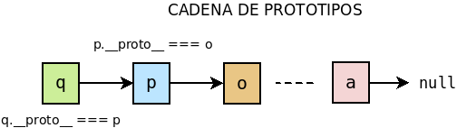

.. _object-model:

Modelo de objetos
*****************
En *Javascript* no existen clases\ [#]_, de modo que los objetos no se crean
mediante la instanciación de clases. Los objetos, en cambio, se crean usando
otro objeto ya existente como prototipo, de manera que el nuevo objeto posee las
características de su prototipo y añade otras nuevas que podamos conferirle. El
prototipo a su vez tendrá su propio prototipo, y así sucesivamente hasta llegar
a un último objeto básico cuyo prototipo es :code:`null`. De este modo, para
acceder al atributo o método de un objeto se consulta si éste está definido en
el propio objeto, si no lo esa, se consulta en su prototipo; si no, en el
prototipo del prototipo y así sucesivamente. A esto es a lo que se llama
:dfn:`cadena de prototipos`.

.. note:: La cadena de prototipos tiene un prototipo final que se
   caracteriza porque su prototipo es *null*.

Conceptos básicos
=================
Creación
--------
Hay cuatro mecanismos distintos para la creación de objetos:

Directa
"""""""
La forma más directa y sencilla de crear un objeto es declararlo
explícitamente::

   var obj = {};

En este caso, el prototipo de *obj* (que podemos averiguar a través del método
`Object.getPrototypeOf`_), es el último objeto posible de la *cadena de
prototipos*, o sea, ese objeto cuyo prototipo, a su vez, es :code:`null`::

   var prototipo_obj = Object.getPrototypeOf(obj);  // Es "o" en el gráfico.
   Object.getPrototypeOf(prototipo_obj);  // Devuelve null

Otra forma de obtener el prototipo de un objeto es a través del atributo
estándar a partir de *ES2015* `__proto__`_ (aunque aun así se desaconseja)::

   obj.__proto__.__proto__ === null;  // Es true.

.. warning:: Aunque `__proto__`_ no es atributo de sólo lectura y existe el método
   `Object.setPrototypeOf`_, alterar la cadena de prototipos afecta dramáticamente
   al rendimiento de la aplicación.

Por prototipo
"""""""""""""
Otra forma de crear un objeto es definirlo a partir de otro que actúe como su
prototipo::

   var p = Object.create(obj);

De este modo, obtenemos un objeto *p* cuyo prototipo es *obj*::

   p.__proto__ === obj  // Es true.

.. _object-const:

Por constructor
"""""""""""""""
Un último método para crear un objeto es definir una función constructora::

   function MiObjeto(value) {
      this.value = value;
   }

   var q = new MiObjeto(5);
   console.log(q.value);   // Imprime 5.

Si al invocar la función se usa el operador `new
<https://developer.mozilla.org/en-US/docs/Web/JavaScript/Reference/Operators/new>`_,
éste hace que el objeto this_ de la función represente el propio objeto que se
pretende crear y que se devuelva tal objeto. 

En este caso, el prototipo del nuevo objeto es la propiedad `prototype
<https://developer.mozilla.org/en-US/docs/Web/JavaScript/Reference/Global_Objects/Object/prototype>`_
de la función constructora::

   q.__proto__ === MiObjeto.prototype     // true

De hecho, existe la función constructura `Object
<https://developer.mozilla.org/en-US/docs/Web/JavaScript/Reference/Global_Objects/Object>`_,
y la forma explícita que usamos para crear un objeto vacío es equivalente a::

   var o = new Object();

por tanto::

   o.__proto__ === Object.prototype

y::

   Object.prototype.__proto___ === null

Además, el prototipo del atributo *prototype* de cualquier función es el
prototipo de ``Object``::

   MiObjeto.prototype.__proto__ === Object.prototype

Por otro lado, el atributo *prototype* de la función constructora tiene un
atributo `constructor
<https://developer.mozilla.org/en-US/docs/Web/JavaScript/Reference/Global_Objects/Object/constructor>`_,
que es la propia función constructora::

   MiObjeto.prototype.constructor === MiObjecto

Por pseudo-clase
""""""""""""""""
A partir de *ES2015*, se introdujo un mecanismo para crear objetos a
partir de clases que, en realidad. no son tales::

   class Persona {
      constructor(nombre, nacimiento, sexo) {
         this.nombre = nombre;
         this.nacimiento = nacimiento;
         this.sexo = sexo;
         this.defuncion = null;
      }

      // Definiciones de métodos y atributos que se tratarán más adelante.
   }

   var pepe = new Persona("Pepe", "1980-11-09", "V");

Este código sí resulta familiar a un programador versado en la programación
orientada a objetos basada en clases. Sin embargo, esta sintaxis sólo es
`azúcar sintáctico`_ ya que la orientación a objetos sigue siendo basada en
prototipos. De hecho, si tras la definición probamos a consultar qué es
``Persona``::

   typeof Persona  // function

obtendremos que la supuesta clase es en realidad una mera función constructora.

.. _object-model-attr:

Atributos
---------
Para **definir** atributos basta con *enchufárselos* al objeto::

   var o = {};       // El objeto está vacio.
   o.value = 5;
   o["value"] = 10;  // Alternativa.
   o.getValue = function() { return this.value; };  // Es un método.

.. note:: La *notación de array* es muy útil cuando el nombre del atributo
   se encuentra en una variable::

      var attr = "value";
      console.log(o[attr]);  // 10.

Por supuesto, es posible añadir atributos en el momento de la creación del
objeto::

   var o = {
      value: 10,
      getValue: function() {
         return this.value;
      }
   }

Como consecuencia de la :ref:`cadena de prototipos <object-model>`, cualquier
método o atributo que se encuentre enchufado a uno de los prototipos y que no
haya sido sobrescrito, es accesible también::

   var p = Object.create(o);
   console.log<p.x);  // 10.

Recuérdese que cuando :ref:`se construye un objeto a partir de una función
constructora <object-const>`, el prototipo del objeto coincide con el atributo
*prototype* de la función, por lo que cualquier atributo que se enchufe a él
será accesible por el objeto::

   function MiObjeto(value) {
      this.value = value;
   }
   MiObjeto.prototype.x = 100;

   var q = new MiObjeto(5);
   console.log(q.x);  // 100:

Volveremos más adelante sobre este concepto al explicar :ref:`cómo construir de
forma sistemática objetos que representen instancias de un mismo tipo
<javascript-clases>` (o sea, lo que en la orientación a objetos basada en
clases. llamaríamos instancias de una misma clase)

Dado que desde un objeto son accesibles tanto los atributos propios como los
atributos de cualquiera de los prototipos de la cadena, es conveniente saber
cómo distinguir si son propios o heredados:

.. warning:: Al tratar los :ref:`descriptores <object-descriptors>` explicaremos
   el concepto de *propiedad enumerable*.

`Object.keys()`_
   Devuelve un array con los nombres de los **atributos propios
   enumerables** del objeto::

      var o = {x: 1};
      var p = Object.create(o);
      p.y = 2;
      console.log(Object.keys(p));  // [ 'y' ]

   Son semejantes, `Object.values()`_, que devuelve los valores en vez de los
   nombres y `Object.entries()`_, que devuelve tuplas nombre-valor.

`Object.getOwnPropertyNames()`_
   Devuelve un array con los nombres de **todos los atributos propios** del
   objeto (sean o no enumerables).

`.hasOwnProperty(name)`_
   Deuelve :code:`true` sólo en caso de que el atributo suministrado sea propio
   del objeto::

      p.hasOwnProperty("y");           // true.
      p.hasOwnProperty("x");           // false.
      p.hasOwnProperty("no_existo");  // false.

`for ... in`_
   Itera sobre **todos los atributos enumerables** del objeto, incluidos los
   heredados::

      for(const name in p) {
         console.log(name);  // Dos iteraciones, una "x" y otra "y".
      }

Métodos
-------
Al ser las funciones en *Javascript* ciudadanas de primera clase, podemos
considerar los métodos como atributos cuya valor es una función. Es, por tanto,
aplicable todo lo indicado bajo el epígrafe dedicado a los :ref:`atributos
<object-model-attr>`, con lo cual sólo es necesario aclarar la naturaleza del
contexto (el objeto this_) en los métodos: this_ representa el objeto al que
pertenece el método::

   var o = {x: 1};
   o.getX = function() {
      return this.x;       // this es "o".
   }

En caso de que se use no un método propio del objeto, sino un método definido en
algún objeto intermedio de la cadena de prototipos, this_ representa igualmente
al objeto::

   var p = Object.create(o);
   p.x = 2;
   p.getX();   // Devuelve 2, ya que this es "p".

.. _object-descriptors:

Descriptores
------------
Hasta ahora, nos hemos limitado a añadir atributos a los objetos sin excesivo
cuidado::

   var o = {x: 1};
   o.y = 2;

esto es, sin preocuparnos de su visibilidad o la posibilidad de modificar su
valor. Si consultamos mediante `Object.getOwNPropertyDescriptor()`_ las
características de cualquiera de los dos atributos, obtendremos lo siguiente::

   Object.getOwnPropertyDescriptor(o, "x");
   { value: 1, writable: true, enumerable: true, configurable: true }

esto es, el valor del atributo y tres características:

* **writable**, que determina si el atributo puede modificar su valor.
* **enumerable**, que determina que el atributo debe listarse al iterar mediante
  el bucle `for ... in`_ o al usar `Object.keys()`_, `Object.values()`_ o
  `Object.entries()`_.
* **configurable**, que determina si se pueden modificar estas mismas
  características.

.. _object-data-descriptor:

**Descriptor de datos**
   Al objeto que describe el valor y las caracteríscas del atributo se le denomina
   :dfn:`descriptor de datos` y puede definirse mediante varias vías:

   `Object.defineProperty()`_
      Permite definir o redefinir el descriptor de un atributo::

         // Redefimos la característica enumerable del atributo "x"
         Object.defineProperty(o, "x", {enumerable: false});

         // Definimos un nuevo atributo declarando, además, su descriptor
         Object.defineProperty(o, "z", {
            value: 3,
            enumerable: false,
            writable: true,
            configurable: false
         });

      No es necesario indicar todas las características: se redefinirán sólo
      las que proporcionemos y en el primer caso se conservarán los valores
      preexistentes y en el segundo se establecerán a su valor predeterminado::

         Object.defineProperty(o, "w", {});
         {value: undefined, writable: false, enumerable: false, configurable: false}
         
   `Object.defineProperties()`_
      Como el anterior, pero permite [re]definir varios atributos a la vez::

         Object.defineProperties(o, {
            x: {enumerable: true, configurable: false},  // Redefinición.
            xx: {writable: false, value: 4}              // Atributo nuevo.
         });

   `Object.create()`_
      A la vez que crea un objeto a partir de un prototipo, Con su segundo argumento
      permite definir atributos facilitando sus descriptores de acceso. Este
      segundo argumento, tiene la misma sintaxis que el segundo de
      `Object.defineProperties()`_::

         var p = Object.create({x: 1}, {
            y: {value: 4, enumerable: true},
            z: {writable: true}
         });

      En este caso, *x* es un atributo heredado del prototipo e *y* y *z* atributos
      propios del objeto con las características reseñadas.

**Descriptor de acceso**
   Hay una variante de los descriptores denominada :dfn:`descriptor de acceso` en
   que en vez de facilitar el valor (*value*) y la escribibilidad (*writable*)
   se facilitan un *getter* o un *setter* o ambos, que permiten controlar qué valor
   devuelve el atributo y cómo se le asigna valor::

      Object.defineProperty(p, "temperatura", {
         get: function() {  // this es "p"
            return this._temperatura;
         },
         set: function(value) { // this es "p"
            if(value < 0) console.error("Temperatura en Kelvin");
            this._temperatura = value;
         },
         enumerable: true
      });
      Object.defineProperty(this, "_temperatura", {writable: true});

      p.temperatura = 300;
      console.log(p.temperatura);  // 300.

      p.temperatura = -10;  // Error.

   En el ejemplo, almacenamos el valor en la variable escondida
   *_temperatura* y, gracias al *setter*, controlamos que no se pueda asignar un
   valor negativo.

   Se puede usar una sintaxis alternativa a la anterior::

      Object.defineProperty(p, "temperatura", {
         get() {  // this es "p"
            return this._temperatura;
         },
         set(value) { // this es "p"
            if(value < 0) console.error("Temperatura en Kelvin");
            this._temperatura = value;
         },
         enumerable: true
      });
      Object.defineProperty(this, "_temperatura", {writable: true});

   Por otro lado, podemos definir directamente descriptores de acceso
   cuando creamos un objeto::

      var o = {
         x: 1,
         get temperatura() {
            return this._temperatura;
         },
         set temperatura(value) {
            if(value < 0) console.error("Temperatura en Kelvin");
            this._temperatura = value;
         }
      }
      Object.defineProperty(this, "_temperatura", {writable: true});

   .. warning:: En este último caso, los valores de *configurable* y
      *enumerable* del atributo *temperatura* son :code:`true`, esto es, los
      mismos que para u8n atributo como *x* del que no se especifica el
      descriptor de datos.

.. _javascript-clases:

Plantillas (o sea, clases)
==========================
Si queremos lograr un código limpio y ordenado y que cumpla con los principios
de encapsulación o ocultación típicos de la programación orientada a objetos, no
es una buena práctica construir de cualquier forma objetos que modelen un mismo
tipo de entidad. Hay, fundamentamente, dos estrategias:

- Usar el :ref:`patrón del módulo <js-module-pattern>` y una función constructora,
  que es el enfoque más próximo al modelo de *Javascript*.
- Utilizar el azúcar sintáctico introducido en *ES2015* y pseudo-definir clases.

Para ilustrar ambos métodos definiremos objetos que representen personas y
utilizaremos estos como base para la definición de personas menores.

Mediante constructor
--------------------
.. literalinclude:: files/persona_constructor.js
   :language: js

Y para construir objetos que modelen menores de edad y hereden de estos:

.. literalinclude:: files/menor_constructor.js
   :language: js

Mediante :code:`class`
----------------------
La sintaxis para crear pseudo-clases es bastante simple y no permite yodas las
posibilidades que brinda tratar directamente con el constructor. Una definición
lo más equivalentemente posible a la anterior es esta:

.. literalinclude:: files/persona_class.js
   :language: js

Las principales diferencias, como consecuencia de las limitaciones, son:

- :code:`_nacimiento`, etc. son atributos enumerables y, aunque se podrían haber
  evitado, esto habría implicado usar `Object.defineProperty()`_, que es algo que
  queremos evitar para no enmarañar la claridad de la nueva sintaxis. Lo
  deseable es que hubiera un modo de hacer privados tales atributos.

- La variable privada :code:`sexo` se ha tenido que implementar como un *getter*
  estático que es público.

- :code:`check_fecha` se ha implementado como un método estático público, porque
  no hay modo de hacerlo privado.

.. seealso:: Hay ya propuestas para añadir al estándar la posibilidad de
   controlar la visibilidad o permitir dentro de la propia clase la definición
   de atributos estáticos. Consulte, `el repositorio de Github
   <https://github.com/tc39/proposal-class-fields>`_ o `este artículo de
   sitepoint.com <https://www.sitepoint.com/javascript-private-class-fields/>`_.

Extender esta clase para construir una que modele a un menor de edad es
sencillo:

.. literalinclude:: files/menor_class.js
   :language: js

Características
===============
Si echamos un vistazo a algún manual que trate la programación orientada a
objetos, se nos informará de que tal programación se caracteriza por:

* La *abstracción*, esto es, que únicamente se modelan las caracteristicas y los
  comportamientos relevantes para la resolución del problema.
* El *encapsulamiento*, esto es, que se modela dentro del objeto todo el
  comportamiento y las características de la entidad.
* La *ocultación*, o sea, los objetos se comportan como cajas negras de suerte
  que al exterior sólo se ofrece una |API| que permite interactuar con el
  objeto, mientras que su implementación resulta irrelevante para el resto del
  código.
* La *herencia*, que establece una jerarquía de objetos en la que unos objetos
  heredan comportamientos y características de otros.

Si aplicamos estas características al modelo de objetos de *Javascript* nos
encontramos con:

Abstracción
-----------
Restringiendo la discusión sobre abstracción a interfaces y clases abstractas,
*Javascript* no habilita ningún mecanismo para ellas, lo cual es lógico puesto
que se basa en el uso de prototipos. Si se quiere, no obstante, obligar de
alguna manera a que el prototipo de un objeto implemente una interfaz, podemos
improvisar un módulo como :download:`interface.js <files/interface.js>`:

.. code-block:: js
   :emphasize-lines: 15

   const doInterface = require("./interface.js");

   // Los objetos deben implementar una interfaz
   // con el atributo "value" y los métodos "incr()" y "decr()".
   const IncrDecr = doInterface(["incr()", "decr()", "value"]);

   const Foobar = (function() {

      function Foobar(value) {
         Object.defineProperty(this, "_value", {value: value, enumerable: false});
      }

      // Podemos añadir a Foobar.prototype métodos y atributos,

      return IncrDecr.implementedBy(Foobar, {
         // Implementación de la interfaz.
         get value() { return this._value },
         incr() { return ++this._value },
         decr() { return --this._value },

         // Podemos añadir cualesquiera otros atributos y métodos
         // que queremos que formen parte de Foobar.prototype

      });
   })();

   const f = new Foobar(5);
   console.log(f.__interface__ === IncrDecr.id);  // true

Encapsulamiento
---------------
Para encapsular adecuadamente el comportamiento de un tipo de objetos lo más
conveniente es crearlos bien a través de la sintaxis de pseudo-clases bien a
través de la definición de una función constructora a cuyo atributo *prototype*
se añaden los atributos y métodos comunes a todos los objetos del tipo.

Ocultación
----------
Para controlar la visibilidad del código tenemos dos estategias:

- Tradicionalmente, se ha logrado aplicando el :ref:`patrón del módulo
  <js-module-pattern>`, de manera que sólo se exporte la función constructora,
  y jugando con la *enumerabilidad* de los atributos y métodos.

- En caso de que se programe con modulos, puede implementarse el comportamiento
  de un mismop tipo de objetos dentro de un fichero con lo que se logrará el
  mismo efecto que usando el *patrón del módulo*.

Herencia
--------
La *cadena de prototipos* es en sí misma una implementación del mecanismo de la
herencia: un objeto hereda de su prototipo.

.. rubric:: Notas al pie

.. [#] No, no existen, ni siquiera a partir de *ES2015* donde aparece una
   sintaxis para *definir* clases. Abundaremos más adelante en esta aparente
   paradoja.

.. _Object.create(): https://developer.mozilla.org/en-US/docs/Web/JavaScript/Reference/Global_Objects/Object/create
.. _Object.keys(): https://developer.mozilla.org/en-US/docs/Web/JavaScript/Reference/Global_Objects/Object/keys
.. _Object.defineProperty(): https://developer.mozilla.org/en-US/docs/Web/JavaScript/Reference/Global_Objects/Object/defineProperty
.. _Object.defineProperties(): https://developer.mozilla.org/en-US/docs/Web/JavaScript/Reference/Global_Objects/Object/defineProperties
.. _Object.values(): https://developer.mozilla.org/en-US/docs/Web/JavaScript/Reference/Global_Objects/Object/values
.. _Object.getOwnPropertyNames(): https://developer.mozilla.org/en-US/docs/Web/JavaScript/Reference/Global_Objects/Object/getOwnPropertyNames
.. _Object.getOwnPropertyDescriptor(): https://developer.mozilla.org/en-US/docs/Web/JavaScript/Reference/Global_Objects/Object/getOwnPropertyDescriptor
.. _Object.entries(): https://developer.mozilla.org/en-US/docs/Web/JavaScript/Reference/Global_Objects/Object/entries
.. _Object.getPrototypeOf: https://developer.mozilla.org/en-US/docs/Web/JavaScript/Reference/Global_Objects/Object/getPrototypeOf
.. _Object.setPrototypeOf: https://developer.mozilla.org/en-US/docs/Web/JavaScript/Reference/Global_Objects/Object/setPrototypeOf
.. _.hasOwnProperty(name): https://developer.mozilla.org/en-US/docs/Web/JavaScript/Reference/Global_Objects/Object/hasOwnProperty
.. _for ... in: https://developer.mozilla.org/en-US/docs/Web/JavaScript/Reference/Statements/for...in
.. _`__proto__`: https://developer.mozilla.org/en-US/docs/Web/JavaScript/Reference/Global_Objects/Object/proto
.. _this: https://developer.mozilla.org/en-US/docs/Web/JavaScript/Reference/Operators/this
.. _azúcar sintáctico: https://es.wikipedia.org/wiki/Az%C3%BAcar_sint%C3%A1ctico

.. |API| replace:: :abbr:`API (Application Programming Interface)`
